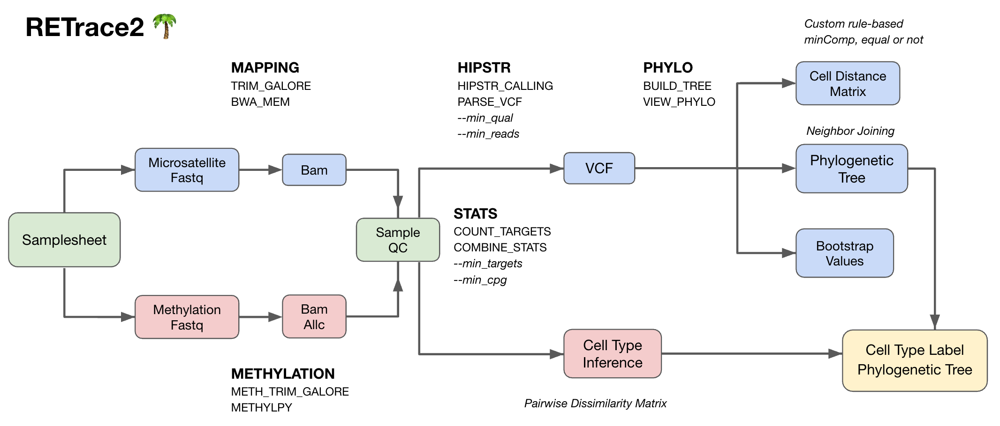

# RETrace2


RETrace2 is a dual-omic Nextflow bioinformatics pipeline for reconstructing single-cell phylogenetic trees using somatic microsatellite mutations and inferring cell type using methylation patterns. The pipeline integrates quality control, alignment, microsatellite genotype calling, distance matrix calculation, and tree reconstruction into a streamlined workflow.
<br>

<p align="center">
  
</p>
<sup><sub><p align="left"><i>This workflow diagram provides a simplified overview of the RETrace2 pipeline. See the documentation below for details.</i></p></sub></sup>

## Table of Contents
- [Features](#features)
- [Pipeline Structure](#pipeline-structure)
- [Test Data](#test-data)
- [Tutorial](#tutorial)
- [Getting Started](#getting-started)
  - [Prerequisites](#prerequisites)
  - [Installation](#installation)
  - [Usage](#usage)
  - [Samplesheet](#samplesheet)
  - [Parameters](#parameters)
- [Environments](#environments)
- [Reference Genome Configuration](#reference-genome-configuration)
- [Reproducibility Notes](#reproducibility-notes)
- [Contributing](#contributing)
- [License](#license)
- [Acknowledgments](#acknowledgments)
- [References](#references)
- [Contact](#contact)

<br>

## Features

- Core pipeline:
  - FastQC and Adapter trimming
  - Alignment with BWA
  - Microsatellite calling with HipSTR
  - Phylogenetic tree reconstruction

- Optional analyses:
  - Tree bootstrapping
  - Methylation analysis for cell type inference

- Current support:
  - Single-end read

<br>

## Pipeline Structure

```
RETrace2/
├── assests/             # samplesheet
├── data/                # test data
├── modules/             # Nextflow modules
│   ├── mapping/         # Read trimming and alignment
│   ├── stats/           # Count targets 
│   ├── hipstr/          # Microsatellite calling
│   ├── phylo/           # Phylogenetic tree reconstruction
│   ├── methylation/     # Methylation processing
│   └── infer_celltype/  # Infer cell type from methylation
├── notebooks/           # Jupyter notebooks
├── resources/           # Probe target bed
├── scripts/             # Supporting scripts
├── main.nf              # Main pipeline
└── nextflow.config      # Pipeline configuration
```

<br>

## Test Data

The repository includes small test datasets in the `data/` directory:

### HCT116 Human Cell Line Data
- 6 FASTQ files with ~100,000 reads each
- HCT116 cell line clones from a cell culture tree model
- 12k probe set targeting homopolymers (10-14bp repeat lengths)

### MSH2 Mouse Data
- 6 FASTQ files with ~400,000 reads for microsatellite libraries and ~100,000 reads for methylation libraries
- Includes both microsatellite and methylation libraries
- Designed for testing dual-omic pipeline capabilities

For details about the test data, see [data/README.md](data/README.md).

<br>

## Tutorial

See [notebooks/Tutorial.ipynb](notebooks/Tutorial.ipynb) for a step-by-step walkthrough using the test dataset.

<br>

## Getting Started

### Installation
```bash
git clone https://github.com/tonypincheng/retrace2.git
cd retrace2
```

### Usage

**Recommended (Docker):**
```bash
nextflow run main.nf -profile docker \
                     --samplesheet path/to/samplesheet.csv \
                     --output_dir results \
                     --genome_base /path/to/genome_base \
                     --genome mm39 \
                     --target_bed path/to/target_bed
```

**Alternative (Local installation):**
```bash
nextflow run main.nf --samplesheet path/to/samplesheet.csv \
                     --output_dir results \
                     --genome_base /path/to/genome_base \
                     --genome mm39 \
                     --target_bed path/to/target_bed
```
<br>

### Samplesheet

The pipeline uses a CSV samplesheet with the following columns:

| Column | Description |
|--------|-------------|
| sample_id | Unique sample identifier (required) |
| ms_fastq_1 | Path to microsatellite FASTQ file (required) |
| meth_fastq_1 | Path to methylation FASTQ file (optional) |
| group | Group identifier for the sample (optional) |
| color | Color for visualization (optional, hex format) |

> **Note:** Currently, RETrace2 only supports single-end read.

An example samplesheet has been provided in [assets/samplesheet_msh2.csv](assets/samplesheet_msh2.csv).

<br>

### Parameters

#### Required Parameters

| Parameter | Default | Description |
|-----------|---------|-------------|
| `--samplesheet` | - | CSV file specifying samples and their details (see example in assets/samplesheet.csv) |
| `--genome_base` | - | Directory containing reference genomes (see [Reference Genome Configuration](#reference-genome-configuration) for details) |
| `--genome` | mm39 | Reference genome: 'mm39' or 'hg38' |
| `--target_bed` | - | BED file in HipSTR format with **1-based coordinates**. Use probe targets for enrichment experiments ([resources/targets](resources/targets)) or download pre-built references from [HipSTR-references](https://github.com/HipSTR-Tool/HipSTR-references/tree/master). See [Target BED Format Documentation](resources/targets/README.md) for detailed format specifications. |

#### Optional Parameters

**General Output Settings:**
| Parameter | Default | Description |
|-----------|---------|-------------|
| `--output_dir` | results | Directory for output files |
| `--output_prefix` | retrace2_analysis | Prefix for output files |
| `--threads` | 1 | Number of CPU threads per task |
| `--memory` | 16.GB | Memory allocation per task |

> **💡 Memory Allocation Tips:**
> - **Too low**: Tasks may get killed (OOM errors) with large datasets
> - **Too high**: Reduces parallelism and resource efficiency (fewer tasks can run simultaneously)
> - **Optimal**: Set based on your data size - monitor actual usage and adjust accordingly
> - **Rule of thumb**: Start with default, increase if you see OOM errors, decrease if you have excess unused memory

**Sample Quality Parameters:**
| Parameter | Default | Description |
|-----------|---------|-------------|
| `--min_targets` | 100 | Minimum number of microsatellite targets per sample |
| `--min_cpgs` | 0 | Minimum number of CpGs per sample for methylation analysis |

**HipSTR Parameters:**
| Parameter | Default | Description |
|-----------|---------|-------------|
| `--hipstr_path` | HipSTR | Path to HipSTR executable. If not specified, uses "HipSTR" from PATH |
| `--min_qual` | 0.9 | Minimum quality score per target for HipSTR |
| `--min_reads` | 10 | Minimum number of reads per target per sample for HipSTR. Also used in STATS module to count targets with min coverage |
| `--max_stutter` | 1 | Maximum stutter ratio per target for HipSTR |
| `--by_chrom` | true | Run HipSTR by chromosome in parallel |

**Phylogenetic Parameters:**
| Parameter | Default | Description |
|-----------|---------|-------------|
| `--dist_metric` | minComp_EqorNot | Distance metric for phylogenetic tree construction |
| `--outgroup` | Midpoint | Outgroup for tree rooting |
| `--color_background` | true | Apply color to background instead of node circles |
| `--circular_tree` | false | Render phylogenetic tree in circular layout |

**Bootstrap Analysis:**
| Parameter | Default | Description |
|-----------|---------|-------------|
| `--run_bootstrap` | false | Run bootstrap analysis |
| `--bootstrap_iterations` | 100 | Number of bootstrap iterations |

**Methylation Analysis:**
| Parameter | Default | Description |
|-----------|---------|-------------|
| `--run_methylation` | false | Run methylation analysis |
| `--min_reads_per_site` | 1 | Minimum number of reads required per cytosine site |
| `--min_shared_sites` | 100 | Minimum number of shared sites required for comparison |
| `--celltype_ref_dir` | - | Directory containing reference cell type files (required for cell type inference) |
| `--celltype_ref_pattern` | *.tsv.gz | Pattern to match files in celltype_ref_dir |
| `--zscore_threshold` | -1.1 | Z-score threshold for cell type inference |

For a complete and up-to-date list of parameters, run `nextflow run main.nf --help` or see the parameter definitions in [main.nf](main.nf).

<br>

## Environments
RETrace2 supports two execution environments.

### Docker (Recommended) 🐳
**✅ Easiest setup - no dependency management required!**

**System Requirements:**
- **OS**: Linux
- **Memory**: 16GB+ RAM recommended
- **Docker**: Version 20.10+ ([install here](https://docs.docker.com/get-docker/))

```bash
# No setup required! Just run with Docker profile
nextflow run main.nf -profile docker
```

The pipeline uses a public Docker image (`tonypincheng/retrace2-python:latest`) that includes all required tools. Docker will automatically pull the image when needed.

For detailed Docker information, see [docker/README_DOCKER.md](docker/README_DOCKER.md).

<br>

### Standard (Local Installation - Default)
For users who prefer local installations or cannot use Docker.

**Software Dependencies:**
- nextflow=25.04.6
- fastqc=0.12.1
- multiqc=1.28
- python=3.9
- trim-galore=0.6.10
- methylpy=1.4.7
- bwa=0.7.19
- pysam=0.22.1
- samtools=1.21
- bcftools=1.21
- picard=3.1.1
- tabix=1.21
- bowtie2=2.5.4
- **HipSTR** (manual compilation required - [see instructions](https://github.com/HipSTR-Tool/HipSTR))

**Python Packages:**
- matplotlib=3.9.4
- seaborn=0.13.2
- more-itertools=10.7.0
- scikit-bio=0.6.3
- ete3=3.1.3
- biopython=1.85
- pandas, numpy, tqdm, psutil

**Installation:**

```bash
# Install most dependencies via conda
conda env create -f environment.yml
conda activate retrace2

# HipSTR must be installed manually from source
git clone https://github.com/HipSTR-Tool/HipSTR
cd HipSTR && make
# Add HipSTR to PATH or use --hipstr_path parameter
```

```bash
# Usage
nextflow run main.nf
```

<br>

## Reference Genome Configuration

### Option 1: Standard Directory Structure

The pipeline uses a standardized directory structure for organizing reference genomes:

```
genome_base/
├── mm39/                  # Genome name
│   ├── raw_fasta/         
│   │   └── mm39.fa        # raw fasta files
│   │   └── mm39.fa.fai          
│   ├── bwa-index/         # BWA index files
│   │   └── mm39.fa        
│   └── methylpl-ref/      # Methylation references
│       └── mm39_f         # Forward methylation reference
│       └── mm39_r         # Reverse methylation reference
├── hg38/
│   └── ...
```

Use this structure with:

```bash
nextflow run main.nf --genome_base /path/to/genome_base --genome hg38
```

### Option 2: Direct Reference Path

Alternatively, specify reference files directly:

```bash
# For BWA alignment
nextflow run main.nf --bwa_index_path /path/to/specific/reference.fa

# For methylation analysis
nextflow run main.nf --run_methylation \
                    --methylpy_ref /path/to/methylation/reference_prefix \
                    --ref_fasta /path/to/reference.fa
```

This option overrides the standard directory structure.

For methylation analysis, the `--methylpy_ref` parameter specifies the prefix path for both forward and reverse methylation references. The pipeline will automatically append "_f" and "_r" to this prefix to locate the forward and reverse reference files, respectively.
<br><br>


## Reproducibility Notes

**Stochasticity**: The pipeline may exhibit some stochasticity in results across runs due to multi-threading effects and algorithmic tie-breaking.

**Published Analysis**: See [notebooks/](notebooks/) for code examples and analysis workflows used with published datasets.

<br>

## Contributing

This project is under active development. Contributions are welcome! Please:
1. Fork the repository
2. Create a feature branch
3. Make your changes
4. Submit a pull request

<br>

## License

This project is licensed under the MIT License - see the [LICENSE](LICENSE) file for details.

<br>

## Acknowledgments

RETrace2 is built upon the original [RETrace](https://github.com/cjwei/RETrace) pipeline by [Chris Wei](https://github.com/cjwei). Key improvements include:

- Reimplemented in Nextflow with Docker containerization for easier deployment
- Expanded support for homopolymers through customizable target BED files
- Target-based bootstrapping for tree confidence assessment
- Integrated methylation analysis for cell type inference
- Included test datasets and tutorial for quick validation

<br>

## References

1. Pin-Chung Cheng, Dmitrii Kamenev, Polina Kameneva, Conor Fitzpatrick, Igor Adameyko, Peter V Kharchenko, Kun Zhang. Retrospective Single Cell Lineage Tracing with Highly Mutable Homopolymers. Manuscript in Preparation. (2025)

2. Christopher Jen-Yue Wei, Kun Zhang. RETrace: simultaneous retrospective lineage tracing and methylation profiling of single cells. Genome research. (2020). https://doi.org/10.1101/gr.255851.119

<br>

## Contact

Pin-Chung (Tony) Cheng 
tonycheng521@gmail.com